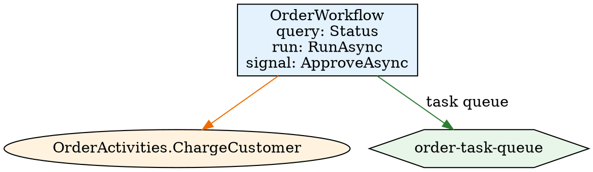

# POC: `temporal-sharp map` — static workflow topology graph

This is a proof-of-concept for a new `map` subcommand in the `temporal-sharp`
CLI. It produces a static **topology graph** of a Temporal .NET codebase:
workflows, their signal/query/update handlers, activities, child workflows,
nexus operations, and task queues — all resolved semantically (no execution,
no Temporal server), and all emitted as Mermaid, JSON, HTML (interactive), or
Graphviz DOT. It accepts **multiple** solutions/projects and stitches them
together into one graph.

The POC lives on branch `poc/map`. It is intentionally scoped to demonstrate
the idea; see [Limitations](#limitations--poc-scope).

## Problem

Temporal applications are composed by convention: a `[Workflow]` type calls
`Workflow.ExecuteActivityAsync(...)`, `Workflow.StartChildWorkflowAsync(...)`,
`Workflow.CreateNexusWorkflowClient(...)`, and so on. Today there is no static,
solution-wide view of how those pieces connect:

- **Topology is implicit.** Workflow → activity / child / nexus relationships are
  encoded only inside method bodies; there is no artifact you can point a
  reviewer at to see the graph.
- **Cross-repo and string-named targets are invisible.** The SDK offers
  string-named fallbacks (`ExecuteActivityAsync("Greet", ...)`,
  `StartChildWorkflowAsync("Child", ...)`, `CreateNexusWorkflowClient("svc")`).
  A grep for an activity type name will never find these, so they silently drop
  out of any ad-hoc map.
- **Task-queue association is scattered** across `TemporalWorkerOptions(...)`
  construction and client `StartWorkflowAsync(..., new { TaskQueue = "..." })`
  calls, again not tied together anywhere.

The `map` subcommand closes that gap: load the solution(s) with Roslyn/MSBuild,
resolve symbols, and emit the resulting graph in a form that is both
human-readable (Mermaid / interactive HTML) and machine-processable (JSON /
DOT).

## The graph model

### Nodes

| `kind`      | Id prefix        | What it is                                                    |
|-------------|------------------|---------------------------------------------------------------|
| `workflow`  | `Workflow:`      | A type with `[Workflow]`                                      |
| `activity`  | `Activity:`      | A method with `[Activity]`                                    |
| `nexus`     | `Nexus:`         | A typed nexus operation method                                |
| `taskQueue` | `TaskQueue:`     | A constant task-queue name (string)                           |
| `unknown`   | `Unknown:`       | A boundary node for a target that could not be statically resolved |

Workflow nodes also carry **handler ports** — the `[WorkflowRun]`,
`[WorkflowSignal]`, `[WorkflowQuery]`, and `[WorkflowUpdate]` members — as
sub-entries (`run:`, `signal:`, `query:`, `update:`) instead of bare workflow
nodes.

`unknown` nodes carry an `unknownKind` (`activity`, `childWorkflow`,
`nexusService`, `nexusOperation`) and use the id shape
`Unknown:<Category>:"<name>"`, e.g. `Unknown:Activity:"Greet"`.

### Edges

| `kind`          | Mermaid arrow | Meaning                                                            |
|-----------------|---------------|--------------------------------------------------------------------|
| `activity`      | `-->`         | workflow executes an activity (`ExecuteActivityAsync`)             |
| `localActivity` | `-->`         | workflow executes a local activity (`ExecuteLocalActivityAsync`)   |
| `childWorkflow` | `-.->`        | workflow starts a child workflow (`StartChildWorkflowAsync`/`ExecuteChildWorkflowAsync`) |
| `nexus`         | `==>`         | workflow starts a nexus operation/service                          |
| `taskQueue`     | `-->|task queue|` | workflow runs on (is registered to / started on) a task queue   |

### How each element is detected

The builder walks every syntax tree of every project in the loaded solution
with a Roslyn `SemanticModel`:

- **Workflow nodes** — types whose attributes include
  `Temporalio.Workflows.WorkflowAttribute`. Handler ports come from the
  `[WorkflowRun]` / `[WorkflowSignal]` / `[WorkflowQuery]` (methods *and*
  query properties) / `[WorkflowUpdate]` members of that type.
- **Activity nodes** — methods with `Temporalio.Activities.ActivityAttribute`.
- **Activity edges** — inside a workflow's method bodies, an invocation of
  `Workflow.ExecuteActivityAsync` / `ExecuteLocalActivityAsync` whose first
  argument is a *typed lambda* (`() => MyActivities.Run()`, or the instance
  form `(MyActivities a) => a.Run(x)`) is resolved via
  `SemanticModel.GetSymbolInfo` on the lambda body. If the resolved method has
  `[Activity]`, an edge to that activity node is emitted.
- **Child-workflow edges** — `StartChildWorkflowAsync` / `ExecuteChildWorkflowAsync`
  typed lambdas resolve to a run method whose containing type has `[Workflow]`.
- **Nexus edges** — `Workflow.CreateNexusWorkflowClient("service")` (service
  boundary/typed) and `NexusWorkflowClient.StartNexusOperationAsync(...)`
  (operation). Typed operations resolve to a `nexus` node; string-named ones
  become `Unknown:NexusService` / `Unknown:NexusOperation` boundary nodes.
- **Task-queue nodes + edges** — constant strings are extracted from
  `TemporalWorkerOptions("queue")` (constructor argument) or
  `TaskQueue = "queue"` object initializers, and from client start options
  (`StartWorkflowOptions { TaskQueue = "..." }`). Workflows are associated via
  `AddWorkflow<T>()` calls on the worker-options instance (fluent chains and
  simple local variables are followed) and via client
  `StartWorkflowAsync` / `ExecuteWorkflowAsync` typed lambdas.
- **Boundary (`Unknown:*`) nodes** — whenever a call uses the *string-named*
  overload (the first argument is a string constant), or a typed lambda resolves
  to a method that lacks the expected attribute (e.g. an activity call whose
  target is not `[Activity]`), an `unknown` node is emitted so the cross-repo /
  unresolved target is still visible in the graph.

## Usage

```
temporal-sharp map <path.sln|path.csproj|dir> [...] [options]

Options:
  --format <mermaid|json|html|dot>  Output format (default: mermaid).
  --output <file>                   Write to a file instead of stdout.
```

`map` accepts **multiple** inputs — repeat the path argument, or pass a
directory containing several solution/project files. Each input is expanded to
a concrete `.sln`/`.csproj` (a directory resolves to its solution, or to all of
its projects when it has none) and all of them are stitched into a single graph.

```sh
# Mermaid flowchart, printed to stdout
temporal-sharp map ./MyApp.sln

# JSON, written to a file
temporal-sharp map ./MyApp.sln --format json --output topology.json

# Self-contained interactive HTML
temporal-sharp map ./MyApp.sln --format html --output topology.html

# Graphviz DOT
temporal-sharp map ./MyApp.sln --format dot --output topology.dot

# Stitch two repositories (a workflow in one, its contracts in the other)
temporal-sharp map ./App.sln ../contracts/Contracts.csproj --format json
```

### Multi-repo / multi-input stitching

When more than one solution/project is passed, the builder walks every input
but keeps a **single node index keyed by fully-qualified type/method name**
(`Namespace.Type` and `Namespace.Type.Method(...)`). So a workflow in solution A
that calls `Workflow.ExecuteActivityAsync(() => Contracts.Shipping.Do(), ...)`,
where `Contracts.Shipping.Do` is a `[Activity]` declared in solution B (pulled
in through a shared contract assembly or project reference), resolves to the
same `Activity:Contracts.Shipping.Do()` node indexed from solution B — a real
edge, not a boundary node. Anything that still cannot be resolved to a
`[Workflow]`/`[Activity]` member stays an `Unknown:*` boundary node.

## Output examples

### Mermaid

The Mermaid emitter produces a `flowchart TB` with `classDef` styling per node
kind, handler ports rendered as `<i>kind: name</i>` lines inside each workflow
node, and distinct arrow styles per edge kind:

```
flowchart TB
    classDef workflow fill:#e3f2fd,stroke:#1565c0;
    classDef activity fill:#fff3e0,stroke:#ef6c00;
    classDef nexus fill:#f3e5f5,stroke:#7b1fa2;
    classDef taskQueue fill:#e8f5e9,stroke:#2e7d32;
    classDef unknown fill:#fbe9e7,stroke:#c62828,stroke-dasharray: 5 5;

    n14["OrderActivities.ChargeCustomer"]:::activity
    n17["order-task-queue"]:::taskQueue
    n19["Activity: LegacyPayment"]:::unknown
    n21["NexusOperation: ShipPackage"]:::unknown
    n22["NexusService: shipping-nexus"]:::unknown
    n29["ChildWorkflow<br/><i>query: Progress</i><br/><i>run: RunAsync</i>"]:::workflow
    n54["OrderWorkflow<br/><i>query: Status</i><br/><i>run: RunAsync</i><br/><i>signal: ApproveAsync</i>"]:::workflow

    n54 --> n14
    n54 -->|task queue| n17
    n54 --> n19
    n54 ==> n21
    n54 ==> n22
    n54 -.-> n29
```

Reading the styling: solid `-->` is a (local) activity call, dotted `-.->` is a
child workflow, thick `==>` is a nexus operation/service, and `-->|task queue|`
links a workflow to the task queue it runs on. Dashed-red `unknown` nodes are
boundary nodes for string-named / cross-repo targets — the "holes" in the
statically-known graph.

### JSON

The JSON emitter serializes the same graph with camelCase keys, so it can be
piped into other tooling:

```json
{
  "nodes": [
    {
      "id": "Unknown:Activity:\"LegacyPayment\"",
      "kind": "unknown",
      "name": "LegacyPayment",
      "unknownKind": "activity",
      "handlers": []
    },
    {
      "id": "Workflow:Kogoshvili.Temporal.SampleApp.OrderWorkflow",
      "kind": "workflow",
      "name": "OrderWorkflow",
      "file": "samples/Temporal.SampleApp/TopologySample.cs",
      "line": 12,
      "handlers": [
        { "kind": "query", "name": "Status" },
        { "kind": "run", "name": "RunAsync" },
        { "kind": "signal", "name": "ApproveAsync" }
      ]
    }
  ],
  "edges": [
    { "from": "Workflow:Kogoshvili.Temporal.SampleApp.OrderWorkflow",
      "to": "Workflow:Kogoshvili.Temporal.SampleApp.ChildWorkflow",
      "kind": "childWorkflow" },
    { "from": "Workflow:Kogoshvili.Temporal.SampleApp.OrderWorkflow",
      "to": "TaskQueue:order-task-queue",
      "kind": "taskQueue" }
  ]
}
```

Workflow/activity/nexus nodes carry `file`/`line` source locations; `unknown`
and `taskQueue` nodes do not (they have no single source location).

### HTML

`--format html` emits a single self-contained `.html` file: the topology JSON is
embedded inline and drawn by a CDN-loaded Mermaid.js (no build step). It adds
minimal interactivity on top of the static diagram:

- **Hover tooltips** — native SVG `<title>` showing `kind · name` and the
  `file:line` source location.
- **Click to highlight** — clicking a node highlights it and its direct
  neighbours and dims the rest.
- **Legend / filter** — a checkbox legend per node kind that shows/hides that
  kind's nodes.

```html
<!DOCTYPE html>
<html lang="en">
<head><title>temporal-sharp map — samples/Temporal.SampleApp/Temporal.SampleApp.csproj</title>
<style> … classDef-colored legend swatches … </style></head>
<body>
<h1>Workflow topology</h1>
<div id="legend"></div>
<div id="diagram"></div>
<script id="topology-data" type="application/json">{ "nodes": [ … ], "edges": [ … ] }</script>
<script src="https://cdn.jsdelivr.net/npm/mermaid@10/dist/mermaid.min.js"></script>
<script>/* builds the flowchart from the embedded JSON, then attaches tooltips,
           click-to-highlight, and the kind filter */</script>
</body>
</html>
```

A rendered example is checked in at `docs/examples/topology.html` (open it in a
browser; it needs network access only for the Mermaid CDN).

### DOT

`--format dot` emits Graphviz DOT with per-kind shapes/colours (workflows = blue
boxes, activities = orange ellipses, nexus = purple diamonds, task queues =
green hexagons, unknowns = dashed red boxes) and per-edge styles (child workflow
= dashed, nexus = bold):



## Running the demo

```sh
./demo.sh
```

The script builds the CLI and the sample app, then runs `map` against
`samples/Temporal.SampleApp` in all four formats (printing mermaid + json and
writing `html`/`dot`), plus a multi-input run. It refreshes everything under
`docs/examples/`.

## Limitations / POC scope

- **Direct calls only.** Edges are traced from method bodies declared directly in
  a `[Workflow]` type. A workflow that calls a helper in another class which in
  turn calls an activity is *not* followed transitively (unlike the existing
  solution call graph used by `analyze`).
- **Best-effort task-queue association.** Worker registration is recognized for
  the fluent form (`new TemporalWorkerOptions("q").AddWorkflow<W>()`) and for a
  simple local variable holding the options; field/property indirection is not
  followed. Client association recognizes `TaskQueue = "..."` object
  initializers on start options.
- **Nexus services are not first-class nodes.** Typed nexus *operations* get a
  `nexus` node; string-named services/operations become `Unknown:` boundaries.
  The service → operation relationship is not linked.
- **No interface/abstract workflow support** and no `[WorkflowInit]` port.
- **Cross-solution stitching is keyed by fully-qualified name**, not assembly
  identity. Two distinct types with the same namespace + type name in different
  repositories would be merged into one node; the POC assumes names are unique
  across the inputs (which is the point of a shared contract assembly).
- **HTML is rendered client-side** by Mermaid.js loaded from a CDN; viewing
  `topology.html` requires network access (for the CDN) and a browser, and the
  kind filter hides nodes but not the edges attached to them.
- **Not a replacement for `analyze`** — this is purely a graph/view, it reports
  no diagnostics.

## Demo

Captured by running `./demo.sh` in this worktree. The full run produces **72
nodes** (49 workflows, 17 activities, 1 task queue, 5 unknown boundaries) and
**16 edges**. Node ids are assigned in deterministic (sorted) order and are
stable for a given input.

### `OrderWorkflow` subgraph (mermaid excerpt — exact)

```
    n14["OrderActivities.ChargeCustomer"]:::activity
    n17["order-task-queue"]:::taskQueue
    n19["Activity: LegacyPayment"]:::unknown
    n21["NexusOperation: ShipPackage"]:::unknown
    n22["NexusService: shipping-nexus"]:::unknown
    n29["ChildWorkflow<br/><i>query: Progress</i><br/><i>run: RunAsync</i>"]:::workflow
    n54["OrderWorkflow<br/><i>query: Status</i><br/><i>run: RunAsync</i><br/><i>signal: ApproveAsync</i>"]:::workflow

    n54 --> n14
    n54 -->|task queue| n17
    n54 --> n19
    n54 ==> n21
    n54 ==> n22
    n54 -.-> n29
```

### JSON excerpt (exact)

```json
{
  "id": "Workflow:Kogoshvili.Temporal.SampleApp.OrderWorkflow",
  "kind": "workflow",
  "name": "OrderWorkflow",
  "file": "samples/Temporal.SampleApp/TopologySample.cs",
  "line": 12,
  "handlers": [
    { "kind": "query", "name": "Status" },
    { "kind": "run", "name": "RunAsync" },
    { "kind": "signal", "name": "ApproveAsync" }
  ]
}
```

```json
{ "id": "Unknown:Activity:\"LegacyPayment\"", "kind": "unknown",
  "name": "LegacyPayment", "unknownKind": "activity", "handlers": [] }
{ "from": "Workflow:Kogoshvili.Temporal.SampleApp.OrderWorkflow",
  "to": "Workflow:Kogoshvili.Temporal.SampleApp.ChildWorkflow", "kind": "childWorkflow" }
{ "from": "Workflow:Kogoshvili.Temporal.SampleApp.OrderWorkflow",
  "to": "TaskQueue:order-task-queue", "kind": "taskQueue" }
```

### Script header (exact)

```
==> Building the CLI
Build succeeded.
    0 Warning(s)
    0 Error(s)

==> Building the sample app
Build succeeded.
    0 Warning(s)
    0 Error(s)

==> map samples/Temporal.SampleApp --format mermaid
flowchart TB
    classDef workflow fill:#e3f2fd,stroke:#1565c0;
    ...

==> map samples/Temporal.SampleApp --format json
{
  "nodes": [ ... ], "edges": [ ... ]
}

==> map samples/Temporal.SampleApp --format html  (docs/examples/topology.html)
Wrote docs/examples/topology.html

==> map samples/Temporal.SampleApp --format dot  (docs/examples/topology.dot)
Wrote docs/examples/topology.dot
--- topology.dot preview ---
digraph temporal_topology {
    graph [rankdir=TB, splines=spline];
    node [fontname="Helvetica"];
    n0 [label="ActivityViolationActivities.LongRunningHeartbeat", shape=ellipse, style="filled", fillcolor="#fff3e0"];
    ...

==> map (multi-input) samples/Temporal.SampleApp + Temporal.sln  (docs/examples/multi-input-topology.json)
Wrote docs/examples/multi-input-topology.json

==> Refreshing docs/examples/
Wrote docs/examples/sample-app-topology.mmd
Wrote docs/examples/sample-app-topology.json

==> Done.
```
