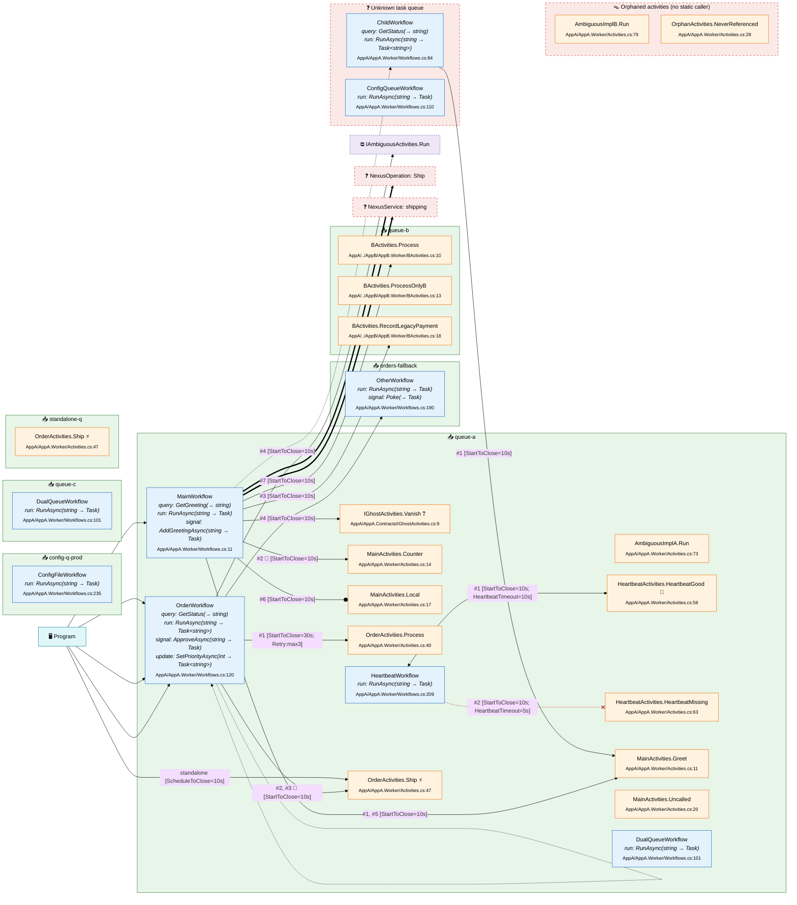

## Legend

| Marker | Meaning |
| --- | --- |
| Blue box | Workflow |
| Orange ellipse | Activity |
| Purple diamond | Nexus operation |
| Green `📥` box | Task queue — contained nodes run on it |
| `🖥` teal box | Caller (client-side entry point) |
| `⧉` dashed box | Contract (ambiguous interface impls) |
| Red dashed box | Unknown task queue / orphaned activities |
| `⚡` | Standalone activity |
| `💓` | Activity calls `Heartbeat(...)` |
| `-->` | Activity call — `#1, #3` call order, `🔁` inside a loop |
| `--o` | Local activity call |
| `-.->` | Child workflow |
| `==>` | Nexus operation/service |
| `<-->` | Activity heartbeats back to its caller |
| `--x` (red) | Issue: heartbeat timeout set, but no heartbeat call |
| `❓` | String-named target not resolved by name |
| `❔` | Contract member with no implementation |
| `Repo/Path:Line` | Where the node lives; `?` when unknown |
| Multi-queue nodes | Duplicated inside every queue they belong to |