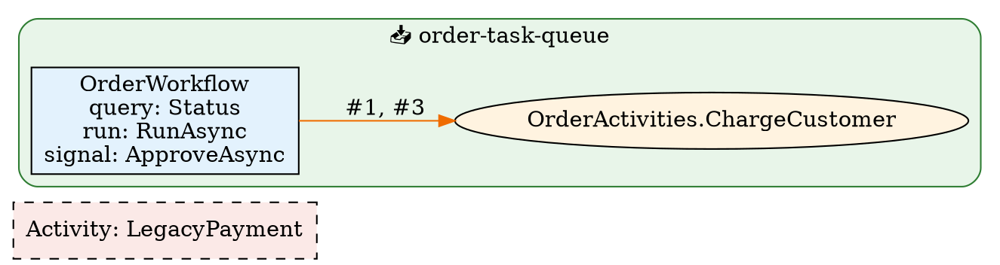

# `temporal-sharp` — the Kogoshvili.Temporal CLI

A standalone `dotnet tool` for the `Kogoshvili.Temporal` tool suite. It re-runs
the Roslyn analyzers over a solution, emits a static workflow topology graph,
downloads workflow histories for replay, and regenerates the rule catalog.

## Minimal setup

Install the tool globally, then run it against a solution. `analyze` is the
default command, so a bare path is enough:

```sh
dotnet tool install -g Kogoshvili.Temporal.Cli
temporal-sharp ./MyApp.sln
```

The above is equivalent to `temporal-sharp analyze ./MyApp.sln`: it loads the
solution with MSBuildWorkspace, runs the analyzers, and prints findings to the
console.

## Configuration

### Commands

| Command | What it does |
| --- | --- |
| `analyze` (default) | Runs the Roslyn analyzers over a solution and reports findings. |
| `map` | Produces a static workflow topology graph (Mermaid/JSON/HTML/DOT/Markdown). |
| `history` | Downloads recorded workflow histories for later replay. |
| `preset` | Emits an `.editorconfig` severity block for a named preset. |

### `analyze`

Run the analyzers over a solution or project, with selectable output format,
exit-code threshold, and per-rule severity overrides:

```text
temporal-sharp analyze <path.sln|path.csproj> [options]
  --format <console|json|sarif>          Output format (default: console).
  --fail-on <none|info|warning|error>    Exit non-zero on findings at or above the given severity (default: none).
  --severity <TMPxxxx=severity>          Override a rule's severity (repeatable).
```

`--severity` also accepts `none` to disable a rule. When `analyze` is invoked
without a subcommand (i.e. `temporal-sharp <path.sln>`), it is the default
action.

```sh
# Fail the build on anything at warning severity or higher
temporal-sharp analyze ./MyApp.sln --fail-on warning

# Machine-readable output
temporal-sharp analyze ./MyApp.sln --format sarif > temporal.sarif

# Disable one rule, promote another
temporal-sharp analyze ./MyApp.sln --severity TMP0001=none --severity TMP2001=error
```

#### GitHub Actions

Run `temporal-sharp` in CI as a pull-request gate, and optionally upload SARIF
so findings appear as GitHub code-scanning annotations:

```yaml
name: temporal-sharp

on:
  pull_request:
  push:
    branches: [main]

jobs:
  analyze:
    runs-on: ubuntu-latest
    steps:
      - uses: actions/checkout@v4

      - uses: actions/setup-dotnet@v4
        with:
          dotnet-version: '8.0.x'

      - name: Install temporal-sharp
        run: dotnet tool install --global Kogoshvili.Temporal.Cli

      - name: Run temporal-sharp
        run: |
          export PATH="$PATH:$HOME/.dotnet/tools"
          temporal-sharp analyze ./MyApp.sln --fail-on warning

      # Optional: emit SARIF and upload for GitHub code scanning.
      - name: Run temporal-sharp (SARIF)
        run: |
          export PATH="$PATH:$HOME/.dotnet/tools"
          temporal-sharp analyze ./MyApp.sln --format sarif > temporal.sarif

      - name: Upload SARIF
        uses: github/codeql-action/upload-sarif@v3
        with:
          sarif_file: temporal.sarif
```

### `history`

Download recorded workflow histories as `*.json` files for later replay with
`Kogoshvili.Temporal.Testing`:

```text
temporal-sharp history download <workflowType> [options]
  --execution-status <status>  Filter by execution status (default: Completed).
  --limit <n>                  Maximum number of histories to download.
  --out <dir>                  Directory to write *.json histories into (required).
  --config <path>              JSON config file (default: appsettings.json + Temporal__* env vars).
```

Authentication uses the shared `Temporal` configuration section and
`Temporal__*` environment variables (including Cloud mTLS / API key). TLS
client certificates may be sourced from a file, environment variables, Azure
Key Vault (`Temporal:Tls:Source=azureKeyVault`), or AWS Secrets Manager
(`Temporal:Tls:Source=awsSecretsManager`) — the cloud sources resolve via the
default Azure/AWS credential chain at connect time.

```sh
temporal-sharp history download OrderWorkflow --out ./histories
temporal-sharp history download OrderWorkflow --execution-status Failed --limit 20 --out ./histories
```

### `preset`

Emit an `.editorconfig` severity block for a named preset:

```text
temporal-sharp preset <recommended|strict> [--write <file>]
```

```sh
temporal-sharp preset recommended
temporal-sharp preset strict --write .editorconfig
```

See the [repository README](../../README.md) for the preset details.

## Full configuration

### `map` — static workflow topology graph

The `map` subcommand produces a static **topology graph** of a Temporal .NET
codebase: workflows, their signal/query/update handlers, activities, child
workflows, nexus operations, and task queues — all resolved semantically (no
execution, no Temporal server), and all emitted as Mermaid, JSON, HTML
(interactive), or Graphviz DOT. It accepts **multiple** solutions/projects and
stitches them together into one graph.

Temporal applications are composed by convention: a `[Workflow]` type calls
`Workflow.ExecuteActivityAsync(...)`, `Workflow.StartChildWorkflowAsync(...)`,
`Workflow.CreateNexusWorkflowClient(...)`, and so on. Today there is no static,
solution-wide view of how those pieces connect:

- **Topology is implicit.** Workflow → activity / child / nexus relationships are
  encoded only inside method bodies; there is no artifact you can point a
  reviewer at to see the graph.
- **Cross-repo and string-named targets are invisible.** The SDK offers
  string-named fallbacks (`ExecuteActivityAsync("Greet", ...)`,
  `StartChildWorkflowAsync("Child", ...)`, `CreateNexusWorkflowClient("svc")`).
  A grep for an activity type name will never find these, so they silently drop
  out of any ad-hoc map.
- **Task-queue association is scattered** across `TemporalWorkerOptions(...)`
  construction and client `StartWorkflowAsync(..., new { TaskQueue = "..." })`
  calls, again not tied together anywhere.

`map` closes that gap: load the solution(s) with Roslyn/MSBuild, resolve
symbols, and emit the resulting graph in a form that is both human-readable
(Mermaid / interactive HTML) and machine-processable (JSON / DOT).

```text
temporal-sharp map <path.sln|path.csproj|dir> [...] [options]

Options:
  --format <mermaid|json|html|dot|markdown>  Output format (default: mermaid).
  --output <file>                   Write to a file instead of stdout.
  --include-tests                   Keep test projects in the graph (excluded by default).
  --no-contracts                    Hide signatures/return types and call options.
  --max-depth <n>                   Directory scan depth (default: 5).
```

Test projects (by `*.Tests.csproj`/`*.Test.csproj` name or a test-framework
reference) are excluded by default, since their mock activities and test
workflows usually just add noise; pass `--include-tests` to keep them. Under
the default contracts view, workflow/activity nodes carry handler signatures
(`run: RunAsync(string) → Task<string>`) and edges carry call-site options
(`#1 [StartToClose=30s; Retry:max3]`).

Projects that have not been NuGet-restored are rejected up front with an
actionable error (run `dotnet restore`), instead of silently mapping to an
empty graph.

`map` accepts **multiple** inputs — repeat the path argument, or pass a
directory containing several solution/project files. A directory is scanned
**recursively** (default 5 levels, tunable with `--max-depth`), so you can
drop several repositories into one folder and map them all at once. Duplicate
inputs are collapsed, and projects referenced by a discovered solution are
skipped (the solution represents them), so a `.csproj` that is both on disk
and inside a `.sln` is never loaded twice; projects outside any solution
(orphan projects) are mapped individually. Hidden directories and build-output
folders (`bin`, `obj`, `artifacts`, `packages`, `node_modules`) are not
scanned. Explicitly listed files are always kept as given.

```sh
# Mermaid flowchart, printed to stdout
temporal-sharp map ./MyApp.sln

# JSON, written to a file
temporal-sharp map ./MyApp.sln --format json --output topology.json

# Self-contained interactive HTML
temporal-sharp map ./MyApp.sln --format html --output topology.html

# Graphviz DOT
temporal-sharp map ./MyApp.sln --format dot --output topology.dot

# Stitch two repositories (a workflow in one, its contracts in the other)
temporal-sharp map ./App.sln ../contracts/Contracts.csproj --format json
```

#### The graph model

**Nodes**

| `kind`      | Id prefix        | What it is                                                    |
|-------------|------------------|---------------------------------------------------------------|
| `workflow`  | `Workflow:`      | A type with `[Workflow]`                                      |
| `activity`  | `Activity:`      | A method with `[Activity]`                                    |
| `nexus`     | `Nexus:`         | A typed nexus operation method                                |
| `taskQueue` | `TaskQueue:`     | A constant task-queue name (string)                           |
| `unknown`   | `Unknown:`       | A boundary node for a target that could not be statically resolved |
| `contract`  | `Contract:`      | An interface/abstract member with ambiguous implementations        |
| `caller`    | `Caller:`        | A non-workflow class that starts/signals/queries from the client   |

Interface- and abstract-based workflows/activities resolve to their unique
implementation node (so a contracts library in project A and the worker in
project B tie together); when two or more implementations exist, the call
resolves to a dashed `⧉ Contract` boundary node instead. Client-side calls are
anchored at `🖥 Caller` nodes.

Task-queue nodes are **container metadata**: the emitters render one box per
queue (green) holding its workflows and activities, an **"Unknown task queue"
box** for nodes whose queue is config-driven or otherwise undetectable, and an
**"Orphaned activities" box** (bottom, dashed red) for uncalled activities with
no detected queue. Nodes associated with *several* queues stay outside all
boxes with an edge into each of their queue boxes. The JSON keeps the explicit
`taskQueue` edges (which may now originate from activities — worker
registration or call-site `ActivityOptions.TaskQueue` routing) plus a shared
`Unknown:TaskQueue` boundary node, so tooling still gets raw data.

Workflow nodes also carry **handler ports** — the `[WorkflowRun]`,
`[WorkflowSignal]`, `[WorkflowQuery]`, and `[WorkflowUpdate]` members — as
sub-entries (`run:`, `signal:`, `query:`, `update:`) instead of bare workflow
nodes.

`unknown` nodes carry an `unknownKind` (`activity`, `childWorkflow`,
`nexusService`, `nexusOperation`) and use the id shape
`Unknown:<Category>:"<name>"`, e.g. `Unknown:Activity:"Greet"`.

**Edges**

| `kind`          | Mermaid arrow | Meaning                                                            |
|-----------------|---------------|--------------------------------------------------------------------|
| `activity`      | `-->`         | workflow executes an activity (`ExecuteActivityAsync`)             |
| `localActivity` | `-->`         | workflow executes a local activity (`ExecuteLocalActivityAsync`)   |
| `childWorkflow` | `-.->`        | workflow starts a child workflow (`StartChildWorkflowAsync`/`ExecuteChildWorkflowAsync`) |
| `nexus`         | `==>`         | workflow starts a nexus operation/service                          |
| `signal`        | (teal)        | client or another workflow signals a workflow                      |
| `query`/`update`| (teal)        | client queries / sends an update to a workflow                     |
| `startWorkflow` | (teal)        | caller starts a workflow                                           |
| `standaloneActivity` | `⚡`     | caller starts a standalone activity                                |

Local activities use a circle arrow (`--o`) instead of the plain call arrow.
Activity edges become bidirectional (`<-->`) when the callee calls
`Heartbeat(...)`; a red crossed edge (`--x`) flags the misconfiguration where
the call site sets `HeartbeatTimeout` but the callee never heartbeats.
| `taskQueue`     | (box)         | workflow/activity runs on / is routed to a task queue (drawn as a container, not an arrow) |

**How each element is detected**

The builder walks every syntax tree of every project in the loaded solution
with a Roslyn `SemanticModel`:

- **Workflow nodes** — types whose attributes include
  `Temporalio.Workflows.WorkflowAttribute`. Handler ports come from the
  `[WorkflowRun]` / `[WorkflowSignal]` / `[WorkflowQuery]` (methods *and*
  query properties) / `[WorkflowUpdate]` members of that type.
- **Activity nodes** — methods with `Temporalio.Activities.ActivityAttribute`.
- **Activity edges** — inside a workflow's method bodies, an invocation of
  `Workflow.ExecuteActivityAsync` / `ExecuteLocalActivityAsync` — or the
  `Kogoshvili.Temporal.Hosting` facades `ActivityOps.ExecuteAsync` /
  `ActivityOps.ExecuteLocalAsync` — whose first argument is a *typed lambda*
  (`() => MyActivities.Run()`, or the instance form `(MyActivities a) => a.Run(x)`)
  is resolved via `SemanticModel.GetSymbolInfo` on the lambda body. If the
  resolved method has `[Activity]`, an edge to that activity node is emitted.
- **Child-workflow edges** — `StartChildWorkflowAsync` / `ExecuteChildWorkflowAsync`
  typed lambdas — or `ChildWorkflowOps.ExecuteAsync` / `ChildWorkflowOps.StartAsync`
  (lambda, single-parameter, and no-argument overloads) — resolve to a run method
  whose containing type has `[Workflow]`.
- **Nexus edges** — `Workflow.CreateNexusWorkflowClient("service")` (service
  boundary/typed) and `NexusWorkflowClient.StartNexusOperationAsync(...)`
  (operation). Typed operations resolve to a `nexus` node; string-named ones
  become `Unknown:NexusService` / `Unknown:NexusOperation` boundary nodes.
- **Task-queue nodes + edges** — constant strings are extracted from
  `TemporalWorkerOptions("queue")` (constructor argument) or
  `TaskQueue = "queue"` object initializers, from client start options
  (`StartWorkflowOptions { TaskQueue = "..." }`), from the hosting starter's
  `AddTemporalWorker("queue")` call, and from the official
  `Temporalio.Extensions.Hosting` facade (`AddHostedTemporalWorker(..., "queue")`
  chained with `AddWorkflow<T>()` / `AddScopedActivities<T>()`). Workflows are
  associated via `AddWorkflow<T>()` calls on the worker-options instance (fluent
  chains and simple local variables are followed), via `.AddWorkflow<T>()` /
  `.AddDiscoveredTypes()` chained off `AddTemporalWorker`, and via client
  `StartWorkflowAsync` / `ExecuteWorkflowAsync` typed lambdas. Activities are
  associated via `AddActivity(lambda)` / `AddAllActivities(typeof(X) | <T>)`
  on `TemporalWorkerOptions`, via the SDK facade's `AddScopedActivities<T>()`,
  and via the hosting starter's `AddDiscoveredTypes()`. Call sites can reroute
  an activity to another queue through `ActivityOptions { TaskQueue = "..." }`.
  Nodes with no statically resolvable queue get an edge to a shared
  `Unknown:TaskQueue` boundary node (rendered as the unknown-queue box).
  Queue names that are not string constants are resolved best-effort from
  env-var helpers with a constant fallback (`GetEnvVarWithDefault("K", "q")`)
  and from configuration indexer keys (`config["Temporal:Worker:TaskQueue"]`)
  against the project's `appsettings.json` + `appsettings.Production.json`
  (never `appsettings.Development.json`). Activities additionally inherit the
  calling workflow's queue when they have no explicit evidence.
- **Client-side calls** — starts, signals, queries, and updates made through
  `GetWorkflowHandle<T>` / `StartWorkflowAsync` / standalone
  `StartActivityAsync` / `ExecuteActivityAsync` produce `Caller:` nodes and
  typed edges; workflow-to-workflow signals via
  `Workflow.GetExternalWorkflowHandle<T>().SignalAsync(...)` connect the two
  workflows directly.
- **Heartbeats** — activities calling `ActivityExecutionContext.Current.Heartbeat(...)`
  are marked `💓` and their call edges render bidirectional; a heartbeat
  timeout without heartbeat calls marks the edge as an issue.
- **String-call resolution** — string-named calls match implementations by the
  SDK's exact naming rules: activities use the explicit `[Activity("Name")]`
  or the method name verbatim; workflows use `[Workflow("Name")]` or the type
  name (with the interface `I`-prefix trimmed); signals/updates trim a
  trailing `Async`. String signals/queries/updates from clients resolve via
  the handle's generic type or the handler-name index; matches become real
  edges (cross-repo included), misses become `❓` boundary nodes. Calls
  through contracts with no implementation anywhere stay on the contract node
  marked `❔`.
- **Provenance** — every node carries its input-solution name and a relative
  source path (`AppA/src/OrderWorkflow.cs:12`) as a sub-line under the label;
  `?` when no location is known.
- **Legend** — raw mermaid/DOT output carries the legend inside the graph;
  `--format markdown` emits the diagram in a fence with the legend as a
  regular table in the space outside the schematic, and the HTML output puts
  it in the page header. Diagrams set a white background via the mermaid init
  directive (dark-theme viewers render transparent backgrounds poorly).
- **Boundary (`Unknown:*`) nodes** — whenever a call uses the *string-named*
  overload (the first argument is a string constant), or a typed lambda resolves
  to a method that lacks the expected attribute (e.g. an activity call whose
  target is not `[Activity]`), an `unknown` node is emitted so the cross-repo /
  unresolved target is still visible in the graph. The shared
  `Unknown:TaskQueue:"unknown"` node is the boundary for undetectable queues.
- **Call order and loops** — activity edges carry `order` (1-based call ordinals
  per calling workflow, in document order) and `inLoop` (true when *any* call
  site is nested in a `for`/`foreach`/`while`/`do`). The mermaid/HTML/DOT
  emitters render these as edge labels like `#1, #3 🔁`.

#### Multi-repo / multi-input stitching

When more than one solution/project is passed, the builder walks every input
but keeps a **single node index keyed by fully-qualified type/method name**
(`Namespace.Type` and `Namespace.Type.Method(...)`). So a workflow in solution A
that calls `Workflow.ExecuteActivityAsync(() => Contracts.Shipping.Do(), ...)`,
where `Contracts.Shipping.Do` is a `[Activity]` declared in solution B (pulled
in through a shared contract assembly or project reference), resolves to the
same `Activity:Contracts.Shipping.Do()` node indexed from solution B — a real
edge, not a boundary node. Anything that still cannot be resolved to a
`[Workflow]`/`[Activity]` member stays an `Unknown:*` boundary node.

#### Output examples

**Mermaid**

The Mermaid emitter produces a `flowchart LR` with `classDef` styling per node
kind, handler ports rendered as `<i>kind: name</i>` lines inside each workflow
node, one subgraph per task queue, and distinct arrow styles per edge kind:

```text
flowchart LR
    classDef workflow fill:#e3f2fd,stroke:#1565c0,color:#000;
    classDef activity fill:#fff3e0,stroke:#ef6c00,color:#000;
    classDef nexus fill:#f3e5f5,stroke:#7b1fa2,color:#000;
    classDef unknown fill:#fbe9e7,stroke:#c62828,stroke-dasharray: 5 5,color:#000;

    n19["Activity: LegacyPayment"]:::unknown
    n21["NexusOperation: ShipPackage"]:::unknown
    n22["NexusService: shipping-nexus"]:::unknown

    subgraph q0["📥 order-task-queue"]
    n14["OrderActivities.ChargeCustomer"]:::activity
    n54["OrderWorkflow<br/><i>query: Status</i><br/><i>run: RunAsync</i><br/><i>signal: ApproveAsync</i>"]:::workflow
    end
    style q0 fill:#e8f5e9,stroke:#2e7d32,color:#000

    subgraph orp["🪤 Orphaned activities (no static caller)"]
    n31["ReportingActivities.Export"]:::activity
    end
    style orp fill:#fbe9e7,stroke:#c62828,stroke-dasharray: 5 5,color:#000

    n54 -->|"#1, #3"| n14
    n54 -->|"#2 🔁"| n33
    n54 --> n19
    n54 ==> n21
    n54 ==> n22
    n54 -.-> n29
```

Reading the styling: solid `-->` is a (local) activity call (labels show the
call order, `🔁` marks calls inside a loop), dotted `-.->` is a child workflow,
and thick `==>` is a nexus operation/service. Queue membership is conveyed by
the green `subgraph` boxes rather than arrows; dashed-red nodes/boxes are
boundary content — string-named targets, undetectable queues, and orphans.

**JSON**

The JSON emitter serializes the same graph with camelCase keys, so it can be
piped into other tooling:

```json
{
  "nodes": [
    {
      "id": "Unknown:Activity:\"LegacyPayment\"",
      "kind": "unknown",
      "name": "LegacyPayment",
      "unknownKind": "activity",
      "handlers": []
    },
    {
      "id": "Workflow:Kogoshvili.Temporal.SampleApp.OrderWorkflow",
      "kind": "workflow",
      "name": "OrderWorkflow",
      "file": "samples/Temporal.SampleApp/TopologySample.cs",
      "line": 12,
      "handlers": [
        { "kind": "query", "name": "Status" },
        { "kind": "run", "name": "RunAsync" },
        { "kind": "signal", "name": "ApproveAsync" }
      ]
    }
  ],
  "edges": [
    { "from": "Workflow:Kogoshvili.Temporal.SampleApp.OrderWorkflow",
      "to": "Workflow:Kogoshvili.Temporal.SampleApp.ChildWorkflow",
      "kind": "childWorkflow" },
    { "from": "Workflow:Kogoshvili.Temporal.SampleApp.OrderWorkflow",
      "to": "Activity:Kogoshvili.Temporal.SampleApp.OrderActivities.ChargeCustomer",
      "kind": "activity",
      "order": [1, 3] },
    { "from": "Activity:Kogoshvili.Temporal.SampleApp.OrderActivities.ChargeCustomer",
      "to": "TaskQueue:order-task-queue",
      "kind": "taskQueue" }
  ]
}
```

Activity edges may carry `order` (1-based call ordinals per calling workflow)
and `inLoop: true`; both are omitted when absent. `taskQueue` edges connect
workflows *and* activities to queue nodes (worker registration, the hosting
facades, or call-site `ActivityOptions.TaskQueue` routing); nodes with no
statically resolvable queue point at `Unknown:TaskQueue:"unknown"`.

Workflow/activity/nexus nodes carry `file`/`line` source locations; `unknown`
and `taskQueue` nodes do not (they have no single source location).

**HTML**

`--format html` emits a single self-contained `.html` file: the topology JSON is
embedded inline and drawn by a CDN-loaded Mermaid.js (no build step). It adds
minimal interactivity on top of the static diagram:

- **Hover tooltips** — native SVG `<title>` showing `kind · name` and the
  `file:line` source location.
- **Click to highlight** — clicking a node highlights it and its direct
  neighbours and dims the rest.
- **Legend / filter** — a checkbox legend per node kind that shows/hides that
  kind's nodes.

```html
<!DOCTYPE html>
<html lang="en">
<head><title>temporal-sharp map — samples/Temporal.SampleApp/Temporal.SampleApp.csproj</title>
<style> … classDef-colored legend swatches … </style></head>
<body>
<h1>Workflow topology</h1>
<div id="legend"></div>
<div id="diagram"></div>
<script id="topology-data" type="application/json">{ "nodes": [ … ], "edges": [ … ] }</script>
<script src="https://cdn.jsdelivr.net/npm/mermaid@10/dist/mermaid.min.js"></script>
<script>/* builds the flowchart from the embedded JSON, then attaches tooltips,
           click-to-highlight, and the kind filter */</script>
</body>
</html>
```

**DOT**

`--format dot` emits Graphviz DOT with per-kind shapes/colours (workflows = blue
boxes, activities = orange ellipses, nexus = purple diamonds, unknowns = dashed
red boxes), one `cluster_` subgraph per task queue, and per-edge styles (child
workflow = dashed, nexus = bold):



### Limitations

- **Direct calls only.** Edges are traced from method bodies declared directly in
  a `[Workflow]` type. A workflow that calls a helper in another class which in
  turn calls an activity is *not* followed transitively (unlike the existing
  solution call graph used by `analyze`).
- **Best-effort task-queue association.** Worker registration is recognized for
  the fluent form (`new TemporalWorkerOptions("q").AddWorkflow<W>()` /
  `.AddActivity(...)` / `.AddAllActivities(...)`), for a simple local variable
  holding the options, for `AddHostedTemporalWorker(..., "q")` chains, and for
  the hosting starter's `AddTemporalWorker("q").AddDiscoveredTypes()`;
  field/property indirection is not followed. Client association recognizes
  `TaskQueue = "..."` object initializers on start options, and call sites can
  reroute activities via `ActivityOptions { TaskQueue = "..." }`. Anything
  config-driven (a queue name read from a variable/env var) falls into the
  "Unknown task queue" box. The hosting starter's `AddDiscoveredTypes()`
  associates the workflows and activities declared in the *same compilation*
  as the call (a proxy for the scanned assembly); a discovery call in one
  project does not reach workflows in a sibling project.
- **Call order is per workflow, document order.** Ordinals count activity
  commands in source order within each workflow; they are not execution-order
  guarantees across branches, and unresolved calls still consume an ordinal
  (a gap in the labels signals a call the analyzer could not resolve).
- **Nexus services are not first-class nodes.** Typed nexus *operations* get a
  `nexus` node; string-named services/operations become `Unknown:` boundaries.
  The service → operation relationship is not linked.
- **No interface/abstract workflow support** and no `[WorkflowInit]` port.
- **Cross-solution stitching is keyed by fully-qualified name**, not assembly
  identity. Two distinct types with the same namespace + type name in different
  repositories would be merged into one node; `map` assumes names are unique
  across the inputs (which is the point of a shared contract assembly).
- **HTML is rendered client-side** by Mermaid.js loaded from a CDN; viewing
  `topology.html` requires network access (for the CDN) and a browser, and the
  kind filter hides nodes but not the edges attached to them.
- **Not a replacement for `analyze`** — this is purely a graph/view, it reports
  no diagnostics.
